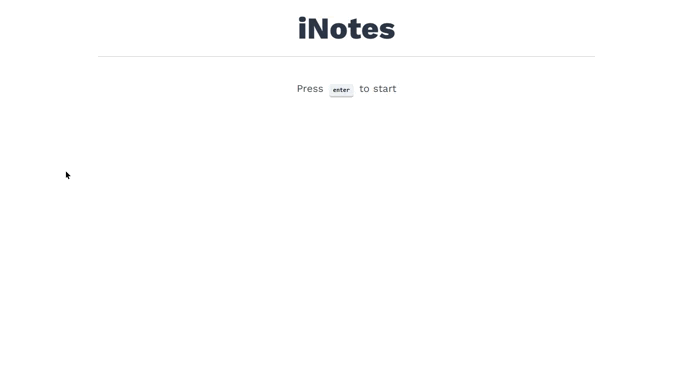

# inotes app
> inotes app with reactjs

## Technology stack

* **Front-end:** [React.Js](https://reactjs.org/)
* **Back-end:** [Node.Js](https://nodejs.org/en/)
* **Typing:** [Typescript](https://www.typescriptlang.org/)

## Running locally

### Global prerequisites 
To run this project in the development mode, you'll need to the server running locally on your machine with the mock data. You can find the server and all the instructions to start the server [here](https://github.com/iamdevmarcos/inotes-api-nodejs).

### Installation
`npm install`

### To run the project
`npm run dev`

© Marcos Andre